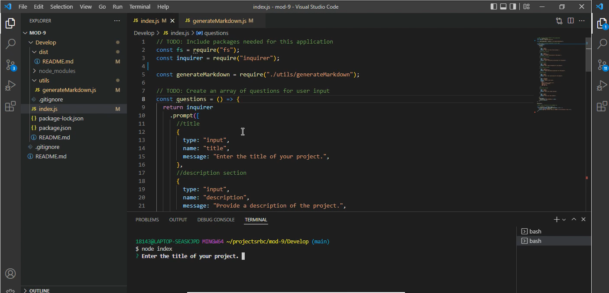

# Professional README Generator

## Description

This application is a professional README generator. This README generator uses inquirer.js to prompt the user to answer a series of questions. The answers to those prompts are then written into a README file.

## Installation

node.js and inquirer.js are needed for installiation.

## Testing

The applicaiton can be tested by using the command node index.js in the root directory of the application.

## Built With

JavaScript
node.js
inquirer.js

## Video Walkthrough

https://watch.screencastify.com/v/jZUFr18QyvoSyA8PZTzx

## ScreenShot

